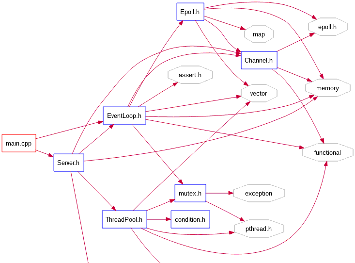
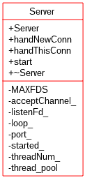
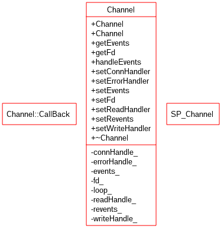
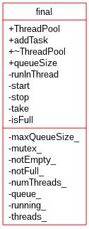

# simpleWebServer
c++实现的简单web服务器，实现GET,POST请求。Reactor模式+线程池

src文件中的文件树
```
├── BoundedBlockingQueue.h  //有界阻塞队列
├── Channel.h  //多路事件分发器
├── condition.h //条件变量的封装
├── CountDownLatch.h  //倒计时闩
├── Epoll.cc  //epoll结构封装，等待事件发生
├── Epoll.h
├── EventLoop.h  //事件循环, 运行在主线程，负责建立新的连接
├── mutex.h  //互斥器
├── readme.md
├── Server.cc //服务端代码 eventloop+threadpool
├── Server.h
├── Task.h  //任务请求http get&post
├── ThreadPool.cc  //静态线程池
├── ThreadPool.h
├── Util.cpp  //功能函数 socket bind listen 
└── Util.h
```




## Server类

Server类的类图如下所示,成员包含三个类：
* acceptChannel //主事件循环中负责分发事件的Channel类
* loop //主反应器中的主事件循环，负责接收连接，用此loop初始化acceptChannel
* thread_pool //固定线程数量的线程池, 与主线程之间利用有界阻塞队列进行消息传递



## Channel类

Channel作为多路事件分发器，负责管理在epoll中注册的回调函数。每一个Channel对一个事件循环EventLoop, Channel的生存周期与EventLoop保持一致，使用shared_ptr来管理。

回调函数有四类：
* 可读回调
* 可写回调
* 错误回调
* 处理新连接回调



## 线程池-事件循环池

主事件循环作为生产者不断向任务队列中添加新的连接， 线程池中的线程从中获取一个新的连接，连接的所有权由主事件循环转移到线程池中工作线程



